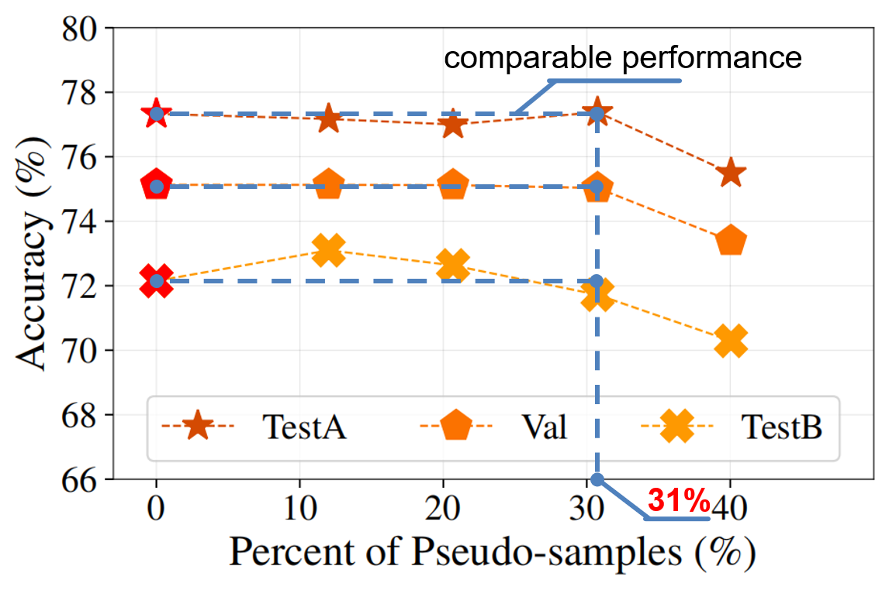

# Pseudo-Q
<p align="center">  </p>

This repository is the official Pytorch implementation for CVPR2022 paper **Pseudo-Q: Generating Pseudo Language Queries for Visual Grounding**. (Primary Contact: [Haojun Jiang](https://github.com/jianghaojun))

<h3 align="center">
Links: <a href="https://arxiv.org/abs/2203.08481">arXiv</a> | <a href="https://cloud.tsinghua.edu.cn/f/e5f6df930e5d4b21ae27/">Poster</a> | <a href="https://cloud.tsinghua.edu.cn/f/d655d6e2a6b246b4bb4f/">Video</a>
</h3>

**Please leave a <font color='orange'>STAR ⭐</font> if you like this project!**

## News
- Update on 2022/03/15: Release the training code.  
- Update on 2022/06/02: Provide the poster and presentation video.
- **Update on 2022/06/04: Release the pseudo-query generation code.**

## Reference

If you find our project useful in your research, please consider citing:

```
@inproceedings{jiang2022pseudoq,
  title={Pseudo-Q: Generating Pseudo Language Queries for Visual Grounding},
  author={Jiang, Haojun and Lin, Yuanze and Han, Dongchen and Song, Shiji and Huang, Gao},
  booktitle={Proceedings of the IEEE Conference on Computer Vision and Pattern Recognition},
  year={2022}
}
```

## Contents

1. [Introduction](#introduction)
2. [Usage](#usage)
3. [Results](#results)
4. [Contacts](#contacts)
5. [Acknowledgments](#acknowledgments)

## Introduction
We present a novel method, named **Pseudo-Q**, to automatically generate pseudo language queries for supervised training. Our method leverages an off-the-shelf object detector to identify visual objects from unlabeled images, and then language queries for these objects are obtained in an unsupervised fashion with a pseudo-query generation module. Extensive experimental results demonstrate that our method has two notable benefits: **(1)** it can reduce human annotation costs significantly, e.g., **31%** on RefCOCO without degrading original model's performance under the fully supervised setting, and **(2)** without bells and whistles, it achieves superior or comparable performance compared to state-of-the-art weakly-supervised visual grounding methods on all the five datasets we have experimented. For more details. please refer to our paper.

## Usage

### Dependencies
- Python 3.9.10
- PyTorch 1.9.0 + cu111 + cp39
- [Pytorch-Bert 0.6.2](https://pypi.org/project/pytorch-pretrained-bert/)
- Check [requirements.txt](requirements.txt) for other dependencies. 


### Data Preparation
1.You can download the images from the original source and place them in `./data/image_data` folder:
- RefCOCO and ReferItGame
- [Flickr30K Entities](http://shannon.cs.illinois.edu/DenotationGraph/#:~:text=make%20face-,Downloads,-Please%20fill%20in)

Finally, the `./data/image_data` folder will have the following structure:

```angular2html
|-- image_data
   |-- data
      |-- flickr
      |-- gref
      |-- gref_umd
      |-- referit
      |-- unc
      |-- unc+
   |-- Flickr30k
      |-- flickr30k-images
   |-- other
      |-- images
      |-- refcoco
      |-- refcoco+
      |-- refcocog
   |-- referit
      |-- images
      |-- mask
      |-- splits
```
- ```./data/image_data/data/xxx/```: Take the Flickr30K dataset as an example, ./data/image_data/data/flickr/ shoud contain files about the dataset's validation/test annotations(bbox-query pairs download from [Gdrive](https://drive.google.com/file/d/1fVwdDvXNbH8uuq_pHD_o5HI7yqeuz0yS/view?usp=sharing)) and our generated pseudo-annotations(pseudo-samples) for this dataset. You should uncompress the provided pseudo-sample files and put them on the corresponding folder.
- ```./data/image_data/Flickr30k/flickr30k-images/```: Image data for the Flickr30K dataset, please download from this [link](http://shannon.cs.illinois.edu/DenotationGraph/#:~:text=make%20face-,Downloads,-Please%20fill%20in). Fill the form and download the images.
- ```./data/image_data/other/images/```: Image data for RefCOCO/RefCOCO+/RefCOCOg. 
- ```./data/image_data/referit/images/```: Image data for ReferItGame.
- Besides, I notice the links of refcoco/refcoco+/refcocog/referit data are not available recently. **You can leave an email in [Issues#2](https://github.com/LeapLabTHU/Pseudo-Q/issues/2) and I will send you a download link**.
- ```./data/image_data/other/refcoco/, ./data/image_data/other/refcoco+/, ./data/image_data/other/refcocog/, ./data/image_data/referit/mask/, ./data/image_data/referit/splits/```: I follow the TransVG to prepare the data and I find these folders actually are not used in training.

2.The generated pseudo region-query pairs can be download from [Tsinghua Cloud](https://cloud.tsinghua.edu.cn/f/0c7ba8c1c0db40cfbea8/?dl=1) or you can generate it follow [instructions](./pseudo_sample_generation/README.md).
```
mkdir data
mv pseudo_samples.tar.gz ./data/
tar -zxvf pseudo_samples.tar.gz
```
Note that to train the model with pseudo samples for different dataset you should put the uncompressed pseudo sample files under the right folder ```./data/image_data/data/xxx/```. For example, put the ```flickr_train_pseudo.pth``` under ```./data/image_data/data/flickr/```.

For generating pseudo-samples, we adopt the pretrained detector and attribute classifier from the [Bottom-Up and Top-Down Attention for Image Captioning and Visual Question Answering](https://arxiv.org/abs/1707.07998). The pytorch implementation of this paper is available at [bottom-up-attention](https://github.com/MILVLG/bottom-up-attention.pytorch).


### Pretrained Checkpoints
1.You can download the DETR checkpoints from [Tsinghua Cloud](https://cloud.tsinghua.edu.cn/f/580d602748174298880d/?dl=1). These checkpoints should be downloaded and move to the [checkpoints](./checkpoints) directory.

```
mkdir checkpoints
mv detr_checkpoints.tar.gz ./checkpoints/
tar -zxvf checkpoints.tar.gz
```

2.Checkpoints that trained on our pseudo-samples can be downloaded from [Tsinghua Cloud](https://cloud.tsinghua.edu.cn/f/ebcfb88241ed45ea8115/?dl=1). You can evaluate the checkpoints following the instruction right below.

```
mv pseudoq_checkpoints.tar.gz ./checkpoints/
tar -zxvf pseudoq_checkpoints.tar.gz
```

### Training and Evaluation

1.  Training on RefCOCO. 
    ```
    CUDA_VISIBLE_DEVICES=0,1,2,3,4,5,6,7 python -m torch.distributed.launch --nproc_per_node=8 --master_port 28888 --use_env train.py --num_workers 8 --epochs 10 --batch_size 32 --lr 0.00025 --lr_bert 0.000025 --lr_visu_cnn 0.000025 --lr_visu_tra 0.000025 --lr_scheduler cosine --aug_crop --aug_scale --aug_translate --backbone resnet50 --detr_model checkpoints/detr-r50-unc.pth --bert_enc_num 12 --detr_enc_num 6 --dataset unc --max_query_len 20 --data_root ./data/image_data --split_root ./data/pseudo_samples/ --prompt "find the region that corresponds to the description {pseudo_query}" --output_dir ./outputs/unc/;
    ```

    Please refer to [scripts/train.sh](scripts/train.sh) for training commands on other datasets.

2.  Evaluation on RefCOCO.
    ```
    CUDA_VISIBLE_DEVICES=0,1,2,3,4,5,6,7 python -m torch.distributed.launch --nproc_per_node=8 --master_port 28888 --use_env eval.py --num_workers 4 --batch_size 128 --backbone resnet50 --bert_enc_num 12 --detr_enc_num 6 --dataset unc --max_query_len 20 --data_root ./data/image_data --split_root ./data/pseudo_samples/ --eval_model ./checkpoints/unc_best_checkpoint.pth --eval_set testA --prompt "find the region that corresponds to the description {pseudo_query}" --output_dir ./outputs/unc/testA/;
    ```
    
    Please refer to [scripts/eval.sh](scripts/eval.sh) for evaluation commands on other splits or datasets.

## Results

**1. Visualization of Pseudo-samples.**

   <p align="center">  </p>

**2. Experiments of Reducing the Manual Labeling Cost on RefCOCO.**

   <p align="center">  </p>

**3. Results on RefCOCO/RefCOCO+/RefCOCOg.**

   <p align="center">  </p>

**4. Results on ReferItGame/Flickr30K Entities.**

   <p align="center">  </p>

**Please refer to our paper for more details.**.

## Contacts
jhj20 at mails dot tsinghua dot edu dot cn

Any discussions or concerns are welcomed!

## Acknowledgments
This codebase is built on [TransVG](https://github.com/djiajunustc/TransVG), [bottom-up-attention](https://github.com/peteanderson80/bottom-up-attention) and [Faster-R-CNN-with-model-pretrained-on-Visual-Genome](https://github.com/shilrley6/Faster-R-CNN-with-model-pretrained-on-Visual-Genome). Please consider citing or starring these projects.
